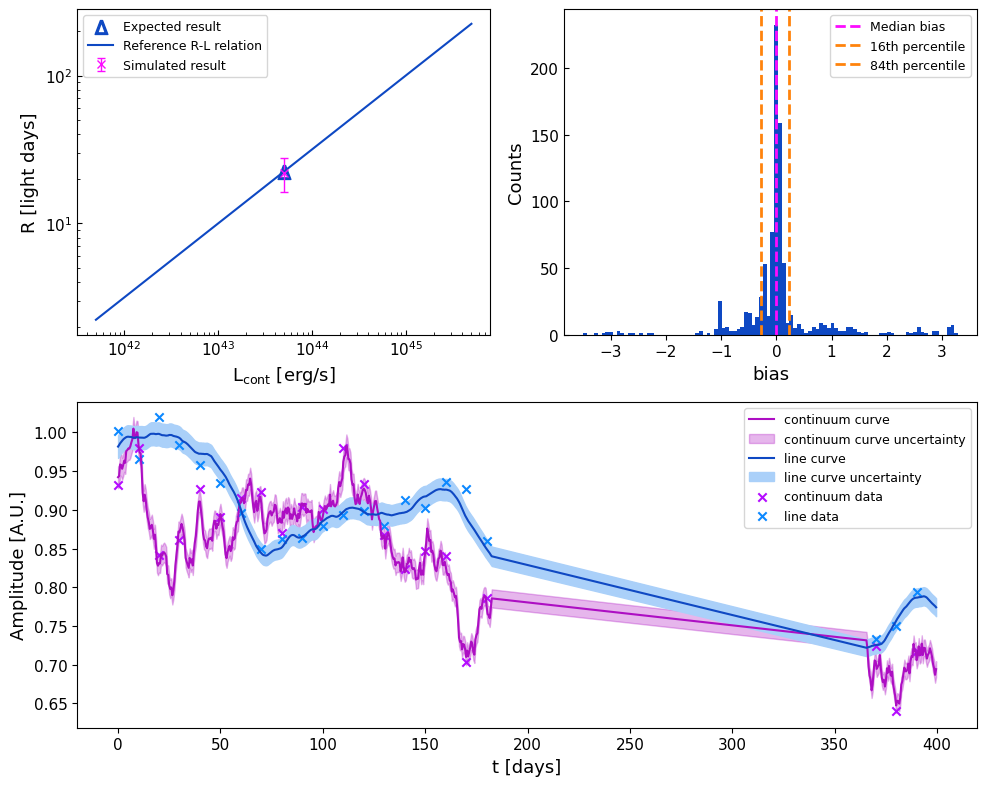

# Reverberation mapping database

Repository accompanying the paper:

"A simulation-based quality-control framework for the broad-line region radius--luminosity relation."

## Overview

This repository contains the open source `pyRMTools` Python package and supplementary material referred to in the manuscript.
`pyRMTools` contains the reverberation mapping database and the reverberation mapping planning tool `scout` to support the observational planning of future reverberation mapping campaigns.

## Repository Structure

| Section        | Description                                                        |
| ---------------| -------------------------------------------------------------------|
| pyRMTools      | Database contents, use examples and utility functions              |
| supplementaries| Supplementary figures and tables                                   |
| reproduction   | Codes for reproduction and RM-Scout                                |
| tutorials      | Tutorials for the use of pyRMTools and MongoDB backend installaion |

---

## Quick Navigation

* [Database contents](database/data/)
* [Python Examples](database/examples/)
* [Reproducibility](simulation_code/)
* [Supplementary Results](results/)
* [RM-Scout](simulation_code/check_RM_parameters.py)

---

## pyRMTools
pyRMTools is a package combining a database of ~1200 AGN studied in reverberation mapping (RM) and a simulation framework of reverberation mapping campaigns.
The database is accessed by a json archive or a MongoDB backend, the latter needing a seperate installation. It contains all the relevant measurements from RM,
such as reverberation lags and luminosities, aswell-as characteristic AGN properties such as position and redshift. The simulation framework `scout` can be used
as a forecast of RM success, aswell-as a first consistency check of published RM data. 

The API of this package is explained in *[ABC](DEF) and tutorials regarding the use of the package and installation of the MongoDB backend in *[ABW](GDE).

### Installation

To install the latest development version:

    git clone https://github.com/Juri-W-S/pyRMTools.git /pyRMTools
    
    cd pyRMTools
    
    pip install .

The database needs no further data downloads, since it is directly distributed with the package installation.

---

## Example Usage

In the `examples/` directory we provide example scripts demonstrating how to access and use the database.

For example on how to compile these R-L figures:

  
  

---

## Reproducibility

All code used to generate the results presented in the manuscript can be found in the `simulation_code/` directory.

With `ICCF_bias.py` the optimized settings for the ICCF algorithm was configured.

`ICCF_trials.py` contains the code that explored the observational parameter space to quantify the recoverability of the ICCF algorithm.

`RM_scout.py` allows the user to test RM observational parameters to quantify the recoverability of the ICCF algorithm for a specific object,
based on the redshift and luminosity.

  

---

## Supplementary Material

Additional figures and tables, e.g. Table A.1, not included in the manuscript in full size and length are available in `results/`.

---

## Citation

If you use this repository, please cite:

Seib et al., 2026

---

## Contact

[seib@thphys.uni-heidelberg.de](mailto:seib@thphys.uni-heidelberg.de)
