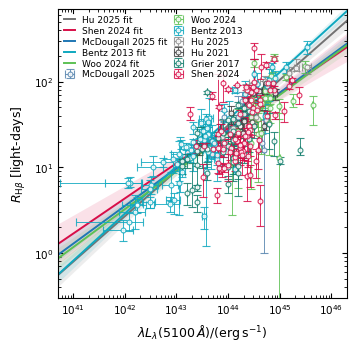
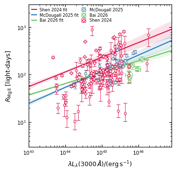

# Reverberation mapping database

Repository accompanying the paper:

"A simulation-based quality-control framework for the broad-line region radius--luminosity relation."

## Overview

This repository contains the database, source code, and supplementary material referred to in the manuscript.

## Repository Structure

| Section         | Description                                             |
| ----------------| --------------------------------------------------------|
| database        | Database contents, use examples and utility functions   |
| results         | Supplementary figures and tables                        |
| simulation_code | Codes for reproduction and RM-Scout                     |

---

## Quick Navigation

* [Database contents](database/data/)
* [Python Examples](database/examples/)
* [Reproducibility](simulation_code/)
* [Supplementary Results](results/)
* [RM-Scout](simulation_code/check_RM_parameters.py)

---

## Dataset

The reverberation mapping database content and the additional readme.txt file containing important supplementary information about contents in the database are available in the `database/data/` directory. Python utility functions to simplify the use of common data retrival tasks can be found in `database/help_functions/`. In `database/examples/` we provide a few examples on how the database can be used, for example to create the figures of the R-L relation in different atomic lines.

---

## Example Usage

In the `examples/` directory we provide example scripts demonstrating how to access and use the database,
for example on how to compile these R-L figures:

  
  

---

## Reproducibility

All code used to generate the results presented in the manuscript can be found in the `reproduction/` directory.

---

## Supplementary Material

Additional figures, tables and analyses not included in the manuscript are available in `results/`.

---

## Citation

If you use this repository, please cite:

Seib et al., 2026

---

## Contact

[seib@thphys.uni-heidelberg.de](mailto:seib@thphys.uni-heidelberg.de)
